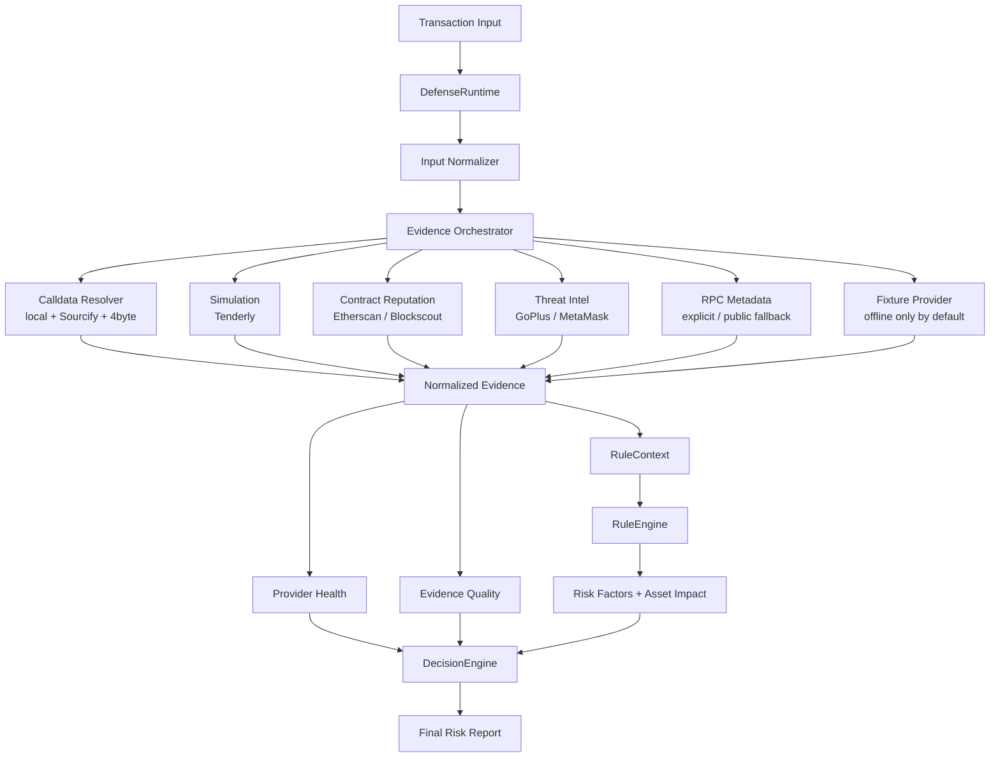

# TxRiskAgent

SignShield-style EVM pre-signature transaction risk analyzer.

The project analyzes wallet transaction JSON before signing. It decodes EVM calldata, classifies approvals/transfers/multicalls/unknown calls, enriches facts through optional real-world adapters, scores risk, and emits structured JSON plus Chinese plain-language warnings.
For ERC20 interactions it also builds a token risk profile covering owner privileges, honeypot/sell restrictions, tax controls, proxy/source transparency, bytecode signals, holder concentration, and LP lock facts when available.

## Target Architecture



## Airdrop Safety Track

This fork also includes an airdrop-focused demo track: **Airdrop Claim Pre-Signature Risk Agent**. The goal is to detect when a user thinks they are claiming an airdrop, but the pending wallet action actually grants an approval, Permit, NFT operator permission, transfer, bundled call, or opaque unknown-contract entrypoint.

Start here:

```text
docs/airdrop-security-cases.md
docs/airdrop-demo-storyline.md
```

Core airdrop demo fixtures:

```bash
mkdir -p output/risk-reports-airdrop
for fixture in \
  dump-tx/2026-06-03T00-01-00-000Z-erc20-unlimited-approval-phishing.json \
  dump-tx/2026-06-03T00-03-00-000Z-eip2612-permit-unlimited-drainer.json \
  dump-tx/2026-06-03T00-04-00-000Z-nft-setapprovalforall-fake-airdrop.json \
  dump-tx/2026-06-03T00-09-00-000Z-multicall-hidden-approval-and-transfer.json \
  dump-tx/2026-06-03T00-11-00-000Z-universal-router-execute-permit2-style-drain.json \
  dump-tx/2026-06-03T00-12-00-000Z-unknown-claim-rewards-selector.json
do
  uv run python skills/signshield-risk/scripts/analyze_evm_tx.py "$fixture" --output output/risk-reports-airdrop
done
```

If `uv` is not installed, the deterministic analyzer also runs with plain
Python:

```bash
mkdir -p output/risk-reports-airdrop
for fixture in \
  dump-tx/2026-06-03T00-01-00-000Z-erc20-unlimited-approval-phishing.json \
  dump-tx/2026-06-03T00-03-00-000Z-eip2612-permit-unlimited-drainer.json \
  dump-tx/2026-06-03T00-04-00-000Z-nft-setapprovalforall-fake-airdrop.json \
  dump-tx/2026-06-03T00-09-00-000Z-multicall-hidden-approval-and-transfer.json \
  dump-tx/2026-06-03T00-11-00-000Z-universal-router-execute-permit2-style-drain.json \
  dump-tx/2026-06-03T00-12-00-000Z-unknown-claim-rewards-selector.json
do
  python3 skills/signshield-risk/scripts/analyze_evm_tx.py "$fixture" --output output/risk-reports-airdrop
done
```

## Quick Start

```bash
uv run python skills/signshield-risk/scripts/analyze_evm_tx.py dump-tx --output output/risk-reports
```

Without `uv`:

```bash
python3 skills/signshield-risk/scripts/analyze_evm_tx.py dump-tx --output output/risk-reports
```

Live enrichment mode:

```bash
uv run python skills/signshield-risk/scripts/analyze_evm_tx.py dump-tx --live --output output/risk-reports-live-smoke
```

Production-style defense mode:

```bash
ETHERSCAN_API_KEY=... uv run python skills/signshield-risk/scripts/analyze_evm_tx.py dump-tx --mode production --output output/risk-reports-production
```

HTTP service:

```bash
uv run uvicorn signshield.http_service:app --app-dir skills/signshield-risk/scripts --host localhost --port 8000
```

Scan one transaction over HTTP:

```powershell
Invoke-RestMethod -Method Post -Uri http://localhost:8000/tx-scan -Headers @{"X-API-Key"=$env:TX_RISK_API_KEY} -ContentType application/json -Body (Get-Content dump-tx/2026-06-02T11-14-54-807Z-20571aef-0d9a-489d-b3e1-3b4aaf982fbd.json -Raw)
```

Check bundled public EVM RPC endpoints:

```bash
uv run python skills/signshield-risk/scripts/check_public_rpc.py > output/public-rpc-check.json
```

Check Etherscan V2 enrichment without writing the key to disk:

```bash
ETHERSCAN_API_KEY=... uv run python skills/signshield-risk/scripts/check_etherscan.py
```

Check live integration health without writing credentials to disk:

```bash
ETHERSCAN_API_KEY=... uv run python skills/signshield-risk/scripts/check_integrations.py
```

Tenderly smoke check with local `.env`:

```bash
source .env
python skills/signshield-risk/scripts/check_integrations.py
python skills/signshield-risk/scripts/analyze_evm_tx.py dump-tx/<file>.json --live
```

Subagent dry-run context:

```bash
uv run python skills/signshield-risk/scripts/analyze_evm_tx.py dump-tx --subagent dry-run --output output/risk-reports-subagent-context
```

Compact output is the CLI default. It writes a short user-facing JSON report and, by default, asks the configured OpenAI model for a final concise summary. Use full output for forensic provider evidence:

```bash
uv run python skills/signshield-risk/scripts/analyze_evm_tx.py dump-tx/<file>.json --live --summary-llm off
uv run python skills/signshield-risk/scripts/analyze_evm_tx.py dump-tx/<file>.json --live --output-format full
```

OpenAI subagent semantic review:

```bash
source .env
uv run python skills/signshield-risk/scripts/analyze_evm_tx.py dump-tx/2026-06-03T00-18-00-000Z-erc20-high-sell-tax-token.json --subagent live --subagent-command "uv run python skills/signshield-risk/scripts/openai_subagent.py"
```

Kimi Agent SDK loop:

```bash
export KIMI_API_KEY=...
export KIMI_BASE_URL=https://api.kimi.com/coding/v1
export SIGNSSHIELD_AGENT_LOOP_MODEL=kimi-code/kimi-for-coding
uv run python skills/signshield-risk/scripts/analyze_evm_tx.py dump-tx/<file>.json --agent-loop kimi --output-format full
```

The Kimi loop is opt-in. It prompts a Kimi agent to first call the read-only
`CollectEvmPrimitives` tool, which exposes normalized wallet input, decoded
calldata, simulation, contract reputation, threat intelligence, ERC20 token
risk profile, provider health, evidence quality, and deterministic candidate
risk signals. The agent can then call Kimi Agent SDK's built-in read-only
`SearchWeb` and `FetchURL` tools, plus project read-only direct-check tools:
`InspectEvmAddress`,
`ReadErc20Metadata`, `InspectContractReputation`, `InspectThreatIntel`, and
`SimulateEvmTransaction`. The agent must return the same
`signshield-risk/v0.2` JSON report shape plus a short user-safe
`reasoningTrace` for UI display. Invalid agent output falls back to
deterministic analysis by default and records the failure under
`evidence.agentLoop`.

Kimi Code uses the OpenAI-compatible provider endpoint
`https://api.kimi.com/coding/v1` with provider model id `kimi-for-coding`.
The Agent SDK model key is `kimi-code/kimi-for-coding`; leave
`KIMI_MODEL_NAME` unset unless you need to override the provider's internal
model id.

`.env` is gitignored. Do not commit local API keys or provider tokens.

## Live Adapters

The live mode supports:

- Sourcify/OpenChain + 4byte calldata selector resolution
- Tenderly transaction simulation
- Etherscan V2 / Blockscout contract reputation
- GoPlus token threat intelligence
- MetaMask eth-phishing-detect domain checks
- Public EVM RPC fallback for ERC20 metadata when `--live` is enabled and no explicit RPC is configured

Optional environment variables:

```bash
export TENDERLY_ACCOUNT_SLUG=...
export TENDERLY_PROJECT_SLUG=...
export TENDERLY_ACCESS_KEY=...
export ETHERSCAN_API_KEY=...
export BLOCKSCOUT_BASE_URL=...
export SIGNSSHIELD_RPC_URL=...
export SIGNSSHIELD_SUBAGENT_COMMAND=...
export SIGNSSHIELD_OPENAI_MODEL=gpt-5.5
export SIGNSSHIELD_OPENAI_REASONING_EFFORT=medium
export SIGNSSHIELD_AGENT_LOOP=off
export SIGNSSHIELD_AGENT_LOOP_MODEL=kimi-code/kimi-for-coding
export KIMI_API_KEY=...
export KIMI_BASE_URL=https://api.kimi.com/coding/v1
```

HTTP service environment variables:

```bash
export TX_RISK_API_KEY=...
export SIGNSSHIELD_HTTP_MODE=production
export SIGNSSHIELD_PUBLIC_RPC_FALLBACK=true
export SIGNSSHIELD_CORS_ORIGINS=*
export SIGNSSHIELD_TIMEOUT=30
export SIGNSSHIELD_AGENT_LOOP=off
export SIGNSSHIELD_AGENT_LOOP_FALLBACK=true
```

Missing credentials are reported in `evidence.limitations`; they do not abort analysis.
Reports also include `evidence.providerHealth` and `evidence.evidenceQuality` so operators can tell which live sources participated in the decision. Runtime modes are:

- `offline`: deterministic demo/test mode; local fixtures may create high-confidence risk factors.
- `live-best-effort`: queries configured live providers and preserves demo fixture behavior for compatibility.
- `production`: disables local fixture labels as high-confidence malicious evidence by default and applies evidence-quality gates to high-uncertainty transactions.

Use `--allow-fixture-risk` only for controlled demos or regression checks outside offline mode.
When `--live` is enabled, `SIGNSSHIELD_RPC_URL` or `--rpc-url` takes precedence. If neither is set, the analyzer probes bundled public HTTP RPC endpoints for the input `chainId` and records the chosen endpoint under `evidence.erc20TokenRisk.metadata.rpcStatus`. Use `--no-public-rpc-fallback` to keep live mode from using public RPC.
Etherscan keys must be supplied through `ETHERSCAN_API_KEY` or `--etherscan-api-key`; never commit them. The adapter records structured source, ABI, proxy, deployment, account, token-transfer, and provider-limitation facts under `evidence.contractReputation.etherscan` without storing full source code.

Subagent live mode uses `SIGNSSHIELD_SUBAGENT_COMMAND`. The command reads context JSON from stdin and writes assessment JSON to stdout.

## HTTP API

`POST /tx-scan` accepts the same JSON shape as `dump-tx/*.json`, either `chainId` plus `transaction` or a flat transaction-like object. If `TX_RISK_API_KEY` is configured, callers must send it as `X-API-Key`. Successful responses return the full `signshield-risk/v0.2` report directly, with an `X-Request-Id` response header and `inputRef` set to `http:tx-scan:<requestId>`.

`GET /health` returns service status, schema version, and the configured mode. By default the service starts in `production` mode with live adapters enabled and local fixture risk disabled. Missing provider credentials are reported inside the risk report instead of failing the request.

`GET /openapi.yaml` returns the service OpenAPI document as YAML for API marketplaces such as xapi.to.

Export a static OpenAPI YAML file:

```bash
uv run python skills/signshield-risk/scripts/export_openapi.py --server-url https://your-railway-domain.up.railway.app --output openapi.yaml
```

Railway deployment uses `railway.json`. Configure at least `TX_RISK_API_KEY` and `SIGNSSHIELD_HTTP_MODE=production` in Railway variables, then deploy the repo. After Railway assigns a public domain, rerun the OpenAPI export command with that domain before submitting the YAML URL or file to xapi.to.

## MetaMask Snap Demo

The local Snap demo lives in:

```text
apps/snap/
```

Start the TxRiskAgent HTTP service first:

```bash
uv run uvicorn signshield.http_service:app --app-dir skills/signshield-risk/scripts --host localhost --port 8000
```

Then run the Snap demo:

```bash
cd apps/snap
npm install
npm run build
npm run start
```

Local demo ports:

- TxRiskAgent API: `http://localhost:8000/tx-scan`
- Snap server: `http://localhost:8080`
- Demo site: `http://127.0.0.1:5173`

The Snap uses MetaMask transaction insight permissions to POST `{chainId, transactionOrigin, transaction}` to `/tx-scan` before signing. It renders `signshield-risk/v0.2` verdicts, summaries, recommendations, and the top risk factors inside MetaMask. The browser demo also previews the same `/tx-scan` response fields in its output panel before submitting a transaction.

## Validate

```bash
uv lock
uv run pytest -q
python3 -m py_compile $(find skills/signshield-risk/scripts -name '*.py' | sort)
```

Without `uv`, install the runtime/test dependencies in your active Python
environment and run the same checks directly:

```bash
python3 -m pip install requests pytest
python3 -m pytest -q
python3 -m py_compile $(find skills/signshield-risk/scripts -name '*.py' | sort)
```

## Skill

The Codex skill lives at:

```text
skills/signshield-risk/
```

Detailed adapter docs:

```text
skills/signshield-risk/references/external_adapters.md
```

Attribution and research notes:

```text
ACKNOWLEDGEMENTS.md
```
