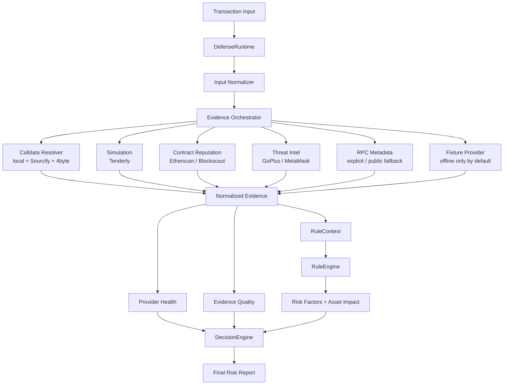

# TxRiskAgent

SignShield-style EVM pre-signature transaction risk analyzer.

The project analyzes wallet transaction JSON before signing. It decodes EVM calldata, classifies approvals/transfers/multicalls/unknown calls, enriches facts through optional real-world adapters, scores risk, and emits structured JSON plus Chinese plain-language warnings.
For ERC20 interactions it also builds a token risk profile covering owner privileges, honeypot/sell restrictions, tax controls, proxy/source transparency, bytecode signals, holder concentration, and LP lock facts when available.

## Target Architecture



## Quick Start

```bash
uv run python skills/signshield-risk/scripts/analyze_evm_tx.py dump-tx --output output/risk-reports
```

Live enrichment mode:

```bash
uv run python skills/signshield-risk/scripts/analyze_evm_tx.py dump-tx --live --output output/risk-reports-live-smoke
```

Production-style defense mode:

```bash
ETHERSCAN_API_KEY=... uv run python skills/signshield-risk/scripts/analyze_evm_tx.py dump-tx --mode production --output output/risk-reports-production
```

Check bundled public EVM RPC endpoints:

```bash
uv run python skills/signshield-risk/scripts/check_public_rpc.py > output/public-rpc-check.json
```

Check Etherscan V2 enrichment without writing the key to disk:

```bash
ETHERSCAN_API_KEY=... uv run python skills/signshield-risk/scripts/check_etherscan.py
```

Check live integration health without writing credentials to disk:

```bash
ETHERSCAN_API_KEY=... uv run python skills/signshield-risk/scripts/check_integrations.py
```

Tenderly smoke check with temporary environment variables:

```bash
TENDERLY_ACCOUNT_SLUG=... TENDERLY_PROJECT_SLUG=... TENDERLY_ACCESS_KEY=... python skills/signshield-risk/scripts/check_integrations.py
TENDERLY_ACCOUNT_SLUG=... TENDERLY_PROJECT_SLUG=... TENDERLY_ACCESS_KEY=... python skills/signshield-risk/scripts/analyze_evm_tx.py dump-tx/2026-06-02T09-47-56-133Z-a850707e-9421-4cd9-a5e6-6fa636023746.json --live
```

Subagent dry-run context:

```bash
uv run python skills/signshield-risk/scripts/analyze_evm_tx.py dump-tx --subagent dry-run --output output/risk-reports-subagent-context
```

OpenAI subagent semantic review:

```bash
OPENAI_API_KEY=... uv run python skills/signshield-risk/scripts/analyze_evm_tx.py dump-tx/2026-06-03T00-18-00-000Z-erc20-high-sell-tax-token.json --subagent live --subagent-command "uv run python skills/signshield-risk/scripts/openai_subagent.py"
```

Do not commit local API keys or provider tokens.

## Live Adapters

The live mode supports:

- Sourcify/OpenChain + 4byte calldata selector resolution
- Tenderly transaction simulation
- Etherscan V2 / Blockscout contract reputation
- GoPlus token threat intelligence
- MetaMask eth-phishing-detect domain checks
- Public EVM RPC fallback for ERC20 metadata when `--live` is enabled and no explicit RPC is configured

Optional environment variables:

```bash
export TENDERLY_ACCOUNT_SLUG=...
export TENDERLY_PROJECT_SLUG=...
export TENDERLY_ACCESS_KEY=...
export ETHERSCAN_API_KEY=...
export BLOCKSCOUT_BASE_URL=...
export SIGNSSHIELD_RPC_URL=...
export SIGNSSHIELD_SUBAGENT_COMMAND=...
export SIGNSSHIELD_OPENAI_MODEL=gpt-5.5
export SIGNSSHIELD_OPENAI_REASONING_EFFORT=medium
```

Missing credentials are reported in `evidence.limitations`; they do not abort analysis.
Reports also include `evidence.providerHealth` and `evidence.evidenceQuality` so operators can tell which live sources participated in the decision. Runtime modes are:

- `offline`: deterministic demo/test mode; local fixtures may create high-confidence risk factors.
- `live-best-effort`: queries configured live providers and preserves demo fixture behavior for compatibility.
- `production`: disables local fixture labels as high-confidence malicious evidence by default and applies evidence-quality gates to high-uncertainty transactions.

Use `--allow-fixture-risk` only for controlled demos or regression checks outside offline mode.
When `--live` is enabled, `SIGNSSHIELD_RPC_URL` or `--rpc-url` takes precedence. If neither is set, the analyzer probes bundled public HTTP RPC endpoints for the input `chainId` and records the chosen endpoint under `evidence.erc20TokenRisk.metadata.rpcStatus`. Use `--no-public-rpc-fallback` to keep live mode from using public RPC.
Etherscan keys must be supplied through `ETHERSCAN_API_KEY` or `--etherscan-api-key`; never commit them. The adapter records structured source, ABI, proxy, deployment, account, token-transfer, and provider-limitation facts under `evidence.contractReputation.etherscan` without storing full source code.

Subagent live mode uses `SIGNSSHIELD_SUBAGENT_COMMAND`. The command reads context JSON from stdin and writes assessment JSON to stdout.

## Validate

```bash
uv lock
uv run pytest -q
python3 -m py_compile $(find skills/signshield-risk/scripts -name '*.py' | sort)
```

## Skill

The Codex skill lives at:

```text
skills/signshield-risk/
```

Detailed adapter docs:

```text
skills/signshield-risk/references/external_adapters.md
```

Attribution and research notes:

```text
ACKNOWLEDGEMENTS.md
```
